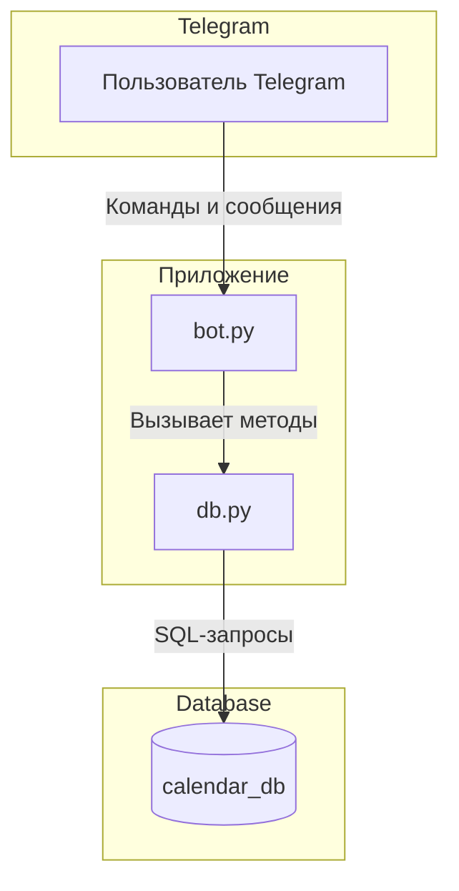
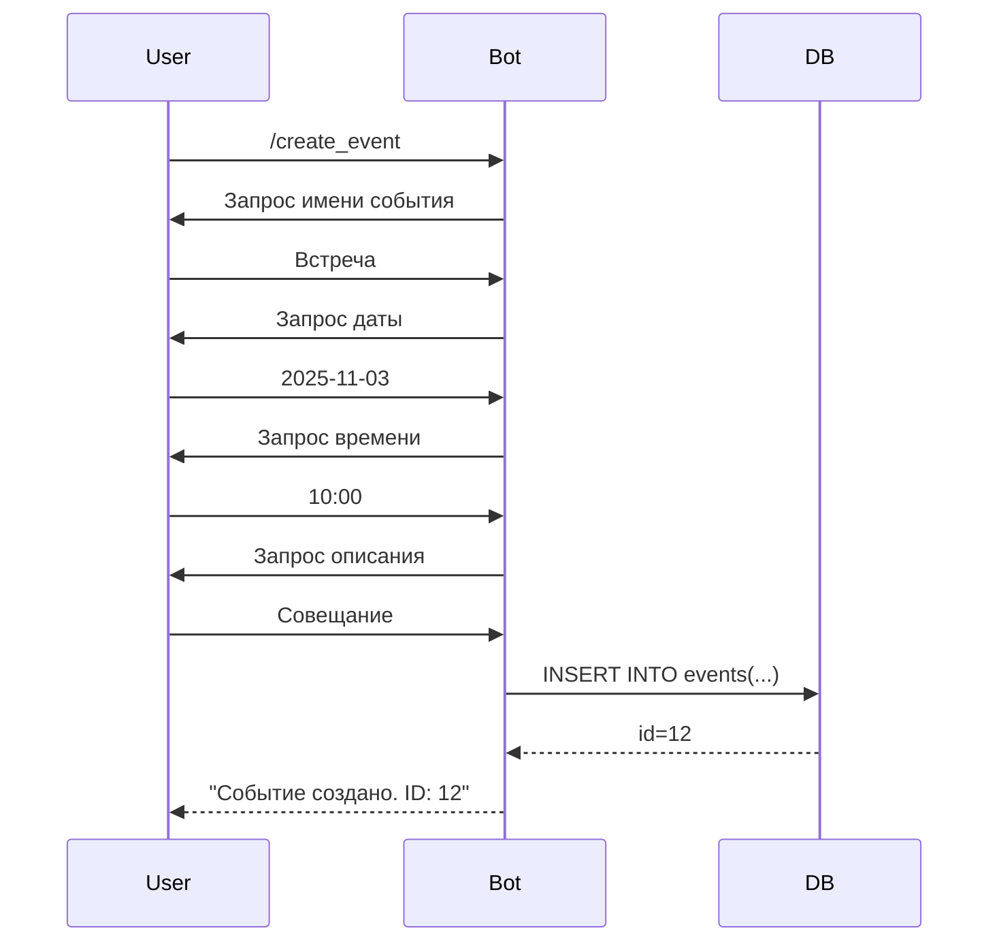

# Проект: Telegram-бот с функцией календаря
# Имя Фамилия — Михаил Кабшанов
# Логин на GitHub — kabshanov
# Telegram - @kabmik

---

# 📘 Документация проекта: Telegram-бот «Календарь»

## 🧩 Общий обзор

Telegram-бот предназначен для создания, просмотра, редактирования и удаления личных событий с сохранением данных в **PostgreSQL**.
Поддерживается многопользовательский режим — каждое событие привязано к конкретному пользователю Telegram.

Проект состоит из двух основных модулей:

| Модуль     | Назначение                                                                                |
| ---------- | ----------------------------------------------------------------------------------------- |
| **bot.py** | Основная логика Telegram-бота, FSM (диалоговые состояния), обработка команд.              |
| **db.py**  | Работа с базой данных PostgreSQL (подключение, CRUD-операции, регистрация пользователей). |

---

## ⚙️ Архитектура и взаимосвязи



---

## 🗄️ Структура базы данных

### Таблица `users`

| Поле         | Тип           | Описание                  |
| ------------ | ------------- | ------------------------- |
| `id`         | `serial`      | Уникальный ID записи      |
| `tg_user_id` | `bigint`      | Telegram-ID пользователя  |
| `username`   | `text`        | Имя пользователя Telegram |
| `first_name` | `text`        | Имя из профиля Telegram   |
| `created_at` | `timestamptz` | Дата регистрации          |

### Таблица `events`

| Поле      | Тип      | Описание                                 |
| --------- | -------- | ---------------------------------------- |
| `id`      | `serial` | Уникальный ID события                    |
| `name`    | `text`   | Название события                         |
| `date`    | `date`   | Дата события                             |
| `time`    | `time`   | Время события                            |
| `details` | `text`   | Описание события                         |
| `user_id` | `bigint` | Telegram-ID пользователя (внешняя связь) |

> Каждое событие привязано к конкретному пользователю через `user_id`.

---

## 🔌 Взаимодействие модулей

| Поток                                          | bot.py                                                | db.py                                            | PostgreSQL                               |
| ---------------------------------------------- | ----------------------------------------------------- | ------------------------------------------------ | ---------------------------------------- |
| 1. Пользователь отправляет команду `/register` | Обработчик вызывает `register_user()`                 | Записывает нового пользователя в таблицу `users` | Создаётся запись в `users`               |
| 2. `/create_event`                             | FSM инициирует диалог (имя → дата → время → описание) | Метод `create_event()` добавляет запись          | Запись сохраняется в `events`            |
| 3. `/display_events`                           | Получает `tg_user_id`                                 | Метод `display_events()` выполняет `SELECT`      | Возвращается список событий пользователя |
| 4. `/edit_event`                               | FSM или inline-режим                                  | Метод `edit_event()` выполняет `UPDATE`          | Изменяется строка в таблице              |
| 5. `/delete_event`                             | FSM или inline-режим                                  | Метод `delete_event()` выполняет `DELETE`        | Удаляется запись                         |
| 6. `/read_event <id>`                          | Обрабатывает ID                                       | Метод `read_event()`                             | Возвращает форматированную информацию    |

---

## 💬 Telegram-команды

| Команда                             | Формат ввода                                                                                                                      | Описание                                    | Формат вывода                         |
| ----------------------------------- | --------------------------------------------------------------------------------------------------------------------------------- | ------------------------------------------- | ------------------------------------- |
| `/start`                            | —                                                                                                                                 | Отображает справку и описание команд        | Текстовое сообщение                   |
| `/help`                             | —                                                                                                                                 | Дублирует `/start`                          | Текстовое сообщение                   |
| `/register`                         | —                                                                                                                                 | Регистрирует пользователя в таблице `users` | Подтверждение регистрации             |
| `/create_event`                     | Диалог: <br>→ введите **название** <br>→ введите **дату** (ГГГГ-ММ-ДД) <br>→ введите **время** (ЧЧ:ММ) <br>→ введите **описание** | Создаёт новое событие                       | Подтверждение с ID созданного события |
| `/display_events`                   | —                                                                                                                                 | Показывает список всех событий пользователя | Перечень событий в виде списка        |
| `/read_event <id>`                  | Пример: `/read_event 5`                                                                                                           | Показывает одно событие по ID               | Форматированный текст события         |
| `/edit_event <id> <новое_описание>` | Пример: `/edit_event 5 Новое описание`                                                                                            | Обновляет описание события                  | Сообщение об успехе или ошибке        |
| `/edit_event`                       | Диалоговый режим: <br>→ ID события <br>→ новое описание                                                                           | То же действие, но по шагам                 | Подтверждение                         |
| `/delete_event <id>`                | Пример: `/delete_event 5`                                                                                                         | Удаляет событие                             | Подтверждение                         |
| `/delete_event`                     | Диалог: <br>→ ID события                                                                                                          | То же действие, но по шагам                 | Подтверждение                         |
| `/cancel`                           | —                                                                                                                                 | Прерывает текущую операцию FSM              | Сообщение «Операция отменена»         |

---

## 🧠 FSM (Finite State Machine)

FSM используется для диалоговых команд (`/create_event`, `/edit_event`, `/delete_event`).

### Состояния

| Поток      | Состояние          | Действие пользователя    | Следующее состояние    |
| ---------- | ------------------ | ------------------------ | ---------------------- |
| **CREATE** | `WAIT_NAME`        | Ввод названия события    | `WAIT_DATE`            |
|            | `WAIT_DATE`        | Ввод даты (`YYYY-MM-DD`) | `WAIT_TIME`            |
|            | `WAIT_TIME`        | Ввод времени (`HH:MM`)   | `WAIT_DETAILS`         |
|            | `WAIT_DETAILS`     | Ввод описания            | Завершение, сохранение |
| **EDIT**   | `WAIT_ID`          | Ввод ID события          | `WAIT_NEW_DETAILS`     |
|            | `WAIT_NEW_DETAILS` | Ввод нового описания     | Завершение             |
| **DELETE** | `WAIT_ID`          | Ввод ID события          | Завершение (удаление)  |

### Поведение FSM

* При вводе команды **«Отмена»** — сбрасывается состояние и клавиатура.
* После успешного завершения операции — состояние очищается (`clear_state`).

---

## 📜 Форматы ввода и вывода

### Пример: создание события

```
Пользователь: /create_event
Бот: Введите название события:
Пользователь: Встреча
Бот: Введите дату в формате ГГГГ-ММ-ДД:
Пользователь: 2025-11-03
Бот: Введите время в формате ЧЧ:ММ (например, 14:30):
Пользователь: 10:00
Бот: Введите описание события:
Пользователь: Совещание по проекту
Бот: Событие создано. ID: 12
```

### Пример: просмотр событий

```
Пользователь: /display_events
Бот:
Список событий:
ID: 12 | 2025-11-03 10:00 | Встреча
ID: 13 | 2025-11-05 14:00 | Звонок клиенту
```

---

## 🧱 Логика обработки команд



---

## 🧩 Валидация данных

| Поле  | Проверка                             | Формат       |
| ----- | ------------------------------------ | ------------ |
| Дата  | `datetime.strptime(..., "%Y-%m-%d")` | `2025-11-03` |
| Время | `datetime.strptime(..., "%H:%M")`    | `14:30`      |
| ID    | `int()`                              | Целое число  |

Ошибки при вводе обрабатываются сообщениями с повторным запросом данных.

---

## 📄 Логирование

Бот ведёт лог-файл через стандартный модуль `logging`.
Примеры логов:

```
2025-10-26 20:58:17 [INFO] FSM CREATE user_id=12345 step=WAIT_DATE msg=2025-11-03
2025-10-26 20:58:22 [INFO] DB create_event ok user_id=12345 id=12
2025-10-26 20:58:22 [INFO] FSM CREATE done user_id=12345 id=12
```

---

## 🧰 Пример развертывания

```bash
# Установка зависимостей
pip install python-telegram-bot==13.13 psycopg2

# Настройка PostgreSQL (psql)
CREATE DATABASE calendar_db;
CREATE USER calendar_user WITH PASSWORD 'calendar_password';
GRANT ALL PRIVILEGES ON DATABASE calendar_db TO calendar_user;

# Создание таблиц
\c calendar_db
\i schema.sql

# Запуск
python bot.py
```

---

## ✅ Ожидаемое поведение

* Каждый пользователь работает со **своими** событиями, изолированно.
* Все команды доступны через меню Telegram.
* FSM корректно обрабатывает шаги диалога и команду «Отмена».
* Все операции фиксируются в логах.
* После перезапуска бота данные сохраняются в базе.

---

**Формат проекта:**

```
project/
│
├── bot.py              # Логика Telegram-бота (FSM)
├── db.py               # Работа с БД (CRUD, регистрация)
├── secrets.py          # Токен API Telegram
├── README.md           # Документация проекта
└── requirements.txt    # Зависимости
```

---

**Технологии:** Python 3.10+, PostgreSQL 15+, Telegram API, FSM

---
