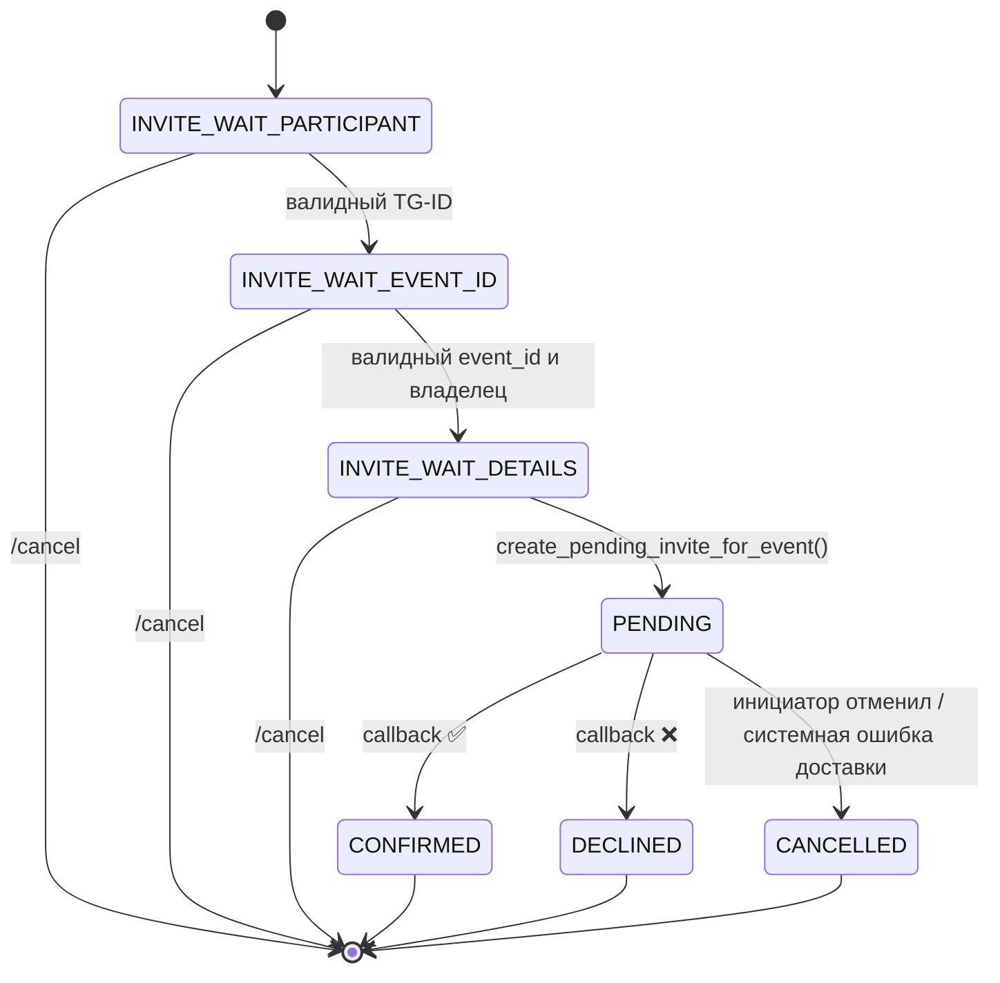

```md
# README_BOT — как работает Telegram-бот календаря

Документ описывает **исключительно работу телеграм-бота**:
команды, диалоги (FSM), форматы сообщений и inline-кнопок,
взаимодействие с БД, учёт статистики, приглашения на встречи
(часть 3 задания), обработку ошибок и логи.

> Веб-часть (Django: админка, модели, миграции, REST-задел) описана
> в `README_DJANGO.md`. Общий обзор проекта — в `README.md`.

---

## Оглавление

- [Краткое описание](#краткое-описание)
- [Архитектура бота](#архитектура-бота)
  - [Основные файлы и пакеты](#основные-файлы-и-пакеты)
  - [Зависимости](#зависимости)
  - [Обзор потоков](#обзор-потоков)
- [Конфигурация и запуск](#конфигурация-и-запуск)
  - [`bot_secrets.py` и пример](#bot_secretspy-и-пример)
  - [Параметры подключения к БД](#параметры-подключения-к-бд)
  - [Запуск бота](#запуск-бота)
  - [Меню команд](#меню-команд)
- [База данных: какие таблицы использует бот](#база-данных-какие-таблицы-использует-бот)
  - [`users`](#users)
  - [`events`](#events)
- [Команды бота](#команды-бота)
  - [`/start`, `/help`](#start-help)
  - [`/register`](#register)
  - [`/create_event` (FSM)](#create_event-fsm)
  - [`/display_events`](#display_events)
  - [`/read_event-id`](#read_event-id)
  - [`/edit_event` (одной строкой или FSM)](#edit_event-одной-строкой-или-fsm)
  - [`/delete_event` (одной строкой или FSM)](#delete_event-одной-строкой-или-fsm)
  - [`/invite` (FSM приглашений)](#invite-fsm-приглашений)
  - [`/cancel`](#cancel)
- [FSM — состояния, переходы, отмена](#fsm--состояния-переходы-отмена)
  - [Структура хранения FSM](#структура-хранения-fsm)
  - [Состояния для создания события](#состояния-для-создания-события)
  - [Состояния для приглашений](#состояния-для-приглашений)
  - [Единые правила валидации даты/времени](#единые-правила-валидации-датывремени)
- [Встречи (Appointments): логика бота](#встречи-appointments-логика-бота)
  - [Проверка занятости участника](#проверка-занятости-участника)
  - [Создание приглашения](#создание-приглашения)
  - [Уведомления и inline-кнопки](#уведомления-и-inlineкнопки)
  - [Подтверждение/отклонение](#подтверждениеотклонение)
  - [Ошибки доставки сообщений](#ошибки-доставки-сообщений)
- [Учёт статистики (BotStatistics)](#учёт-статистики-botstatistics)
- [Логирование](#логирование)
- [Примеры сценариев](#примеры-сценариев)
  - [Создание события (FSM)](#создание-события-fsm)
  - [Редактирование одной строкой](#редактирование-одной-строкой)
  - [Удаление (FSM)](#удаление-fsm)
  - [Приглашение на встречу (FSM + inline)](#приглашение-на-встречу-fsm--inline)
- [Диаграммы](#диаграммы)
  - [Последовательность действий (sequence)](#последовательность-действий-sequence)
  - [Состояния приглашений (state)](#состояния-приглашений-state)
- [Обработка ошибок](#обработка-ошибок)
  - [Ошибки ввода](#ошибки-ввода)
  - [Ошибки БД](#ошибки-бд)
  - [Ошибки Telegram API](#ошибки-telegram-api)
- [Тестирование](#тестирование)
- [Требования к стилю и качеству кода](#требования-к-стилю-и-качеству-кода)
- [Частые вопросы](#частые-вопросы)
- [Чек-лист разработчика](#чеклист-разработчика)
- [История изменений (кратко)](#история-изменений-кратко)

---

## Краткое описание

Бот помогает пользователю управлять личными событиями (создание, просмотр,
редактирование, удаление) и **назначать встречи другим пользователям** на
базе созданных событий. Для встреч реализованы:

- проверка занятости участника на дату/время;
- создание приглашения со статусом **ожидается (pending)**;
- отправка участнику уведомления с inline-кнопками **«✅ Подтвердить»** /
  **«❌ Отклонить»**;
- изменение статуса на **подтверждено / отклонено / отменено** и уведомление
  организатора.

Суточная статистика бота фиксируется в Django-модели `BotStatistics`.

---

## Архитектура бота

### Основные файлы и пакеты

```

project/
├─ bot.py                      # точка входа бота: Updater/Dispatcher, регистрация хендлеров, меню
├─ db.py                       # psycopg2: подключение и CRUD users/events (общая Postgres с Django)
├─ bot_secrets.py              # API_TOKEN (не коммитим; см. secrets_example.py)
├─ secrets_example.py          # шаблон для bot_secrets.py
└─ tgapp/
├─ **init**.py              # пояснительный docstring пакета
├─ core.py                  # общие сервисы: логгер, трекинг статистики, меню команд
├─ fsm.py                   # простая in-memory FSM + парсеры даты/времени
├─ handlers_events.py       # хендлеры событий (create/read/edit/delete, text_router)
└─ handlers_appointments.py # хендлеры приглашений/встреч (FSM + inline callback)

````

**Ключевые идеи**
- **Тонкий `bot.py`**: только сборка и запуск, вся бизнес-логика в `tgapp/*`.
- **Разделение обязанностей**: работа с БД (события/пользователи) в `db.py`;
  взаимодействие со встречами — через Django ORM (модели описаны в веб-части).
- **FSM** — в памяти процесса, без внешнего состояния; подходит для задания.

### Зависимости

- `python-telegram-bot==13.x` (Updater/Dispatcher API)
- `psycopg2-binary` (подключение к PostgreSQL)
- `Django 5.x` (импортируется для статистики и встреч)
- `djangorestframework` (задел под будущие REST-эндпоинты)

### Обзор потоков

- **События**: бот ↔ `db.py` ↔ PostgreSQL (таблица `events`)
- **Встречи**: бот ↔ Django ORM (`Appointment`) ↔ PostgreSQL
- **Статистика**: бот ↔ Django ORM (`BotStatistics`) ↔ PostgreSQL

---

## Конфигурация и запуск

### `bot_secrets.py` и пример

Создайте `bot_secrets.py` на основе `secrets_example.py` и укажите токен:

```python
# bot_secrets.py
API_TOKEN = "1234567890:ABCDEF..."
````

`bot_secrets.py` добавлен в `.gitignore` и не коммитится.

### Параметры подключения к БД

`db.py` содержит функцию `get_connection()` с параметрами подключения
к общей PostgreSQL (совместно с Django). Проверь значения имени БД,
пользователя и пароля перед запуском.

### Запуск бота

Из **корня** проекта:

```bash
python bot.py
```

> Важно запускать из корня, чтобы корректно резолвились импорты и переменная
> окружения `DJANGO_SETTINGS_MODULE` указывала на `webapp.settings`.

### Меню команд

`/start`, `/help`, `/register`, `/create_event`, `/display_events`,
`/read_event`, `/edit_event`, `/delete_event`, `/invite`, `/cancel`.

Меню настраивается при старте (`setup_bot_commands` в `tgapp/core.py`).

---

## База данных: какие таблицы использует бот

Данные хранятся в **PostgreSQL**. События и пользователи бот пишет
через **psycopg2** (`db.py`). Django читает **те же** события через
ORM-модель `Event (managed=False)`.

### `users`

Минимальные поля (вариант учебного задания):

* `tg_user_id BIGINT PRIMARY KEY`
* `username TEXT NULL`
* `first_name TEXT NULL`
* `created_at TIMESTAMP DEFAULT now()`

Используется `/register` для идемпотентной регистрации.

### `events`

Поля:

* `id SERIAL PRIMARY KEY`
* `name VARCHAR(255) NOT NULL`
* `date DATE NOT NULL`
* `time TIME NOT NULL`
* `details TEXT NOT NULL DEFAULT ''`
* `user_id BIGINT NOT NULL` — владелец (Telegram ID)

**Важно:** эта таблица — **общая**. Бот пишет сюда напрямую (psycopg2),
Django видит её через модель `Event(managed=False, db_table="events")`.

---

## Команды бота

### `/start`, `/help`

Краткая справка и ссылки на доступные команды. Идём через `handlers_events.start`
и `handlers_events.help_command`.

### `/register`

Идемпотентно создаёт пользователя в `users`. Если запись уже есть —
возвращает подтверждение без ошибки.

### `/create_event` (FSM)

Пошаговый диалог создания события:

1. `WAIT_NAME` — название
2. `WAIT_DATE` — дата `YYYY-MM-DD`
3. `WAIT_TIME` — время `HH:MM`
4. `WAIT_DETAILS` — описание
5. Вставка в БД и ответ с ID.

Если формат даты/времени неверен — просим повторить ввод.

### `/display_events`

Выводит список событий пользователя:

```
[ID: 1] Брифинг — 2025-12-10 10:00
[ID: 2] ...
```

### `/read_event <id>`

Показывает подробности конкретного события.

### `/edit_event` (одной строкой или FSM)

* **Одной строкой:** `/edit_event <id> <новое описание>`
* **FSM:** без аргументов:

  * `WAIT_ID` → `WAIT_NEW_DETAILS` → запись → «Обновлено».

### `/delete_event` (одной строкой или FSM)

* **Одной строкой:** `/delete_event <id>`
* **FSM:** `WAIT_ID` → удаление → «Удалено».

### `/invite` (FSM приглашений)

Удобный диалог приглашения участника на **ваше событие**:

1. TG-ID участника → 2) ID события → 3) детали/«Пропустить».

Бот проверит:

* что событие принадлежит организатору;
* свободен ли участник в дату/время события.

Если участник свободен — создаётся запись `Appointment(status=pending)`,
участнику отправляется сообщение с inline-кнопками **✅/❌**.

### `/cancel`

Отмена **текущего** диалога (FSM) и очистка состояния. Также доступна
кнопка «Отмена» (ReplyKeyboard).

---

## FSM — состояния, переходы, отмена

### Структура хранения FSM

FSM хранится в памяти процесса:

```python
user_states = {
  tg_id: {
    "flow": "CREATE_EVENT" | "EDIT_EVENT" | "DELETE_EVENT" | "INVITE",
    "step": "WAIT_NAME" | "WAIT_DATE" | ...,
    "data": {...}   # временные поля между шагами
  }
}
```

Операции: `set_state`, `get_state`, `clear_state` — см. `tgapp/fsm.py`.

### Состояния для создания события

`CREATE_EVENT`:

* `WAIT_NAME` → `WAIT_DATE` → `WAIT_TIME` → `WAIT_DETAILS` → вставка в БД

Парсинг даты/времени выполнен в `fsm.py` (`parse_date`, `parse_time`)
с детальными сообщениями об ошибке.

### Состояния для приглашений

`INVITE`:

* `INVITE_WAIT_PARTICIPANT` — ввод TG-ID участника;
* `INVITE_WAIT_EVENT_ID` — ввод ID **вашего** события;
* `INVITE_WAIT_DETAILS` — опциональные детали; `Пропустить` — пустая строка;
* создаём `Appointment(pending)` через Django ORM и отправляем inline-кнопки.

### Единые правила валидации даты/времени

* Дата: `YYYY-MM-DD`, пример `2025-12-12`.
* Время: `HH:MM`, пример `09:05`.
* Сообщения об ошибке формата — одинаковые во всех диалогах.

---

## Встречи (Appointments): логика бота

### Проверка занятости участника

Вызывается `calendarapp.utils.is_user_free(tg_user_id, date, time)`:

* если есть `pending` или `confirmed` встречи на этот слот — участник **занят**;
* иначе — **свободен**.

### Создание приглашения

Через `calendarapp.utils.create_pending_invite_for_event(...)`:

* валидируем владельца события (ID должен принадлежать инициатору);
* проверяем занятость участника;
* создаём `Appointment(status=pending)` с `date/time` из события;
* возвращаем объект встречи и отправляем сообщения.

### Уведомления и inline-кнопки

Участнику отправляется текст приглашения + inline-кнопки:

* **✅ Подтвердить** → callback `appt:confirm:<id>`
* **❌ Отклонить** → callback `appt:decline:<id>`

Организатор получает уведомление о создании приглашения.

### Подтверждение/отклонение

`handlers_appointments.appointment_decision_handler`:

* проверяет пермишены (кнопку жмёт именно приглашённый);
* меняет статус на **confirmed** или **declined**;
* отправляет уведомления обеим сторонам.

### Ошибки доставки сообщений

Если участник **не писал** боту (нет диалога с ботом), отправка ему
сообщения может упасть с ошибкой `Forbidden`. В этом случае:

* логируем ошибку;
* информируем организатора, что участника нужно попросить начать чат с ботом;
* встречу можно оставить в `pending` (ожидание) или перевести в `cancelled`
  — на усмотрение логики (в учебном проекте допустим soft-fail с напоминанием).

---

## Учёт статистики (BotStatistics)

Бот инкрементирует показатели **за текущую дату**:

* `track_new_user()` — после успешной `/register` (только при первом добавлении)
* `track_event_created()` — после создания события
* `track_event_edited()` — после редактирования
* `track_event_cancelled()` — после удаления

> При желании можно расширить и учёт встреч (`appointments_created`,
> `confirmed`, `declined`), но в базовом задании это не обязательно.

---

## Логирование

Используется стандартный `logging`. Записываются:

* входы в команды,
* шаги FSM (flow/step/данные),
* результаты операций с БД,
* статусы приглашений и callback.

Пример логов:

```
INFO tgapp.core: register user tg=123456789 username=michael
INFO tgapp.handlers_events: CREATE_EVENT step=WAIT_TIME msg=12:12
INFO tgapp.handlers_appointments: invite created appt_id=42 pending
INFO tgapp.handlers_appointments: appt confirm appt_id=42 by=987654321
```

---

## Примеры сценариев

### Создание события (FSM)

```
/create_event
→ Введите название события:
Встреча отдела
→ Введите дату в формате ГГГГ-ММ-ДД:
2025-12-12
→ Введите время в формате ЧЧ:ММ:
12:12
→ Введите описание события:
Планёрка по проекту X
→ Событие создано. ID: 2
```

### Редактирование одной строкой

```
/edit_event 2 Обновлённое описание
→ Обновлено.
```

### Удаление (FSM)

```
/delete_event
→ Введите ID события для удаления:
2
→ Удалено.
```

### Приглашение на встречу (FSM + inline)

```
/invite
→ Введите TG-ID участника:
777000
→ Введите ID события:
2
→ Введите детали (или напишите «Пропустить»):
Обсудим финальные сроки
→ Приглашение отправлено. Ожидается подтверждение участника.
```

Участнику:

```
Вас пригласили на встречу:
Дата/время: 2025-12-12 12:12
Детали: Обсудим финальные сроки
[ ✅ Подтвердить ] [ ❌ Отклонить ]
```

Организатору после клика участника:

```
Встреча #42 подтверждена участником @username.
```

или

```
Встреча #42 отклонена участником @username.
```

---

## Диаграммы

### Последовательность действий (sequence)

```mermaid
sequenceDiagram
  participant U as Пользователь (Организатор)
  participant B as Бот (FSM)
  participant DB as БД (PostgreSQL)
  participant DJ as Django ORM

  U->>B: /create_event (шаги FSM)
  B->>DB: INSERT INTO events (...)
  B-->>U: ID события

  U->>B: /invite (шаги FSM)
  B->>DJ: utils.is_user_free(participant, date, time)
  DJ->>DB: SELECT appointments ...
  alt Свободен
    B->>DJ: utils.create_pending_invite_for_event(...)
    DJ->>DB: INSERT INTO appointment (pending)
    B-->>U: приглашение создано, ожидание
    B-->>participant: уведомление + inline-кнопки
  else Занят
    B-->>U: участник занят (список занятых слотов при желании)
  end

  participant->>B: Нажимает ✅/❌
  B->>DJ: update appointment status
  DJ->>DB: UPDATE appointment SET status=...
  B-->>U: уведомление об исходе
```

### Состояния приглашений (state)



---

## Обработка ошибок

### Ошибки ввода

* Неверный формат даты/времени → дружелюбное сообщение с примером.
* Не число там, где нужен ID → просьба повторить ввод.
* Событие не принадлежит пользователю → запрет действия и подсказка.

### Ошибки БД

* Вставка/обновление неудачны — короткое сообщение пользователю и запись в лог.
* Для критичных исключений — лог уровня `ERROR`.

### Ошибки Telegram API

* `Forbidden: bot was blocked by the user` / «чат не начат»:

  * логируем,
  * информируем организатора,
  * встречу помечаем «ожидается» или «отменено» — по принятой политике.

---

## Тестирование

* Юнит-тесты парсеров даты/времени (`fsm.py`).
* Тесты FSM-веток: корректные переходы, `/cancel` на каждом шаге.
* Тесты CRUD-операций с событиями (через `db.py`) на локальной БД.
* Тесты приглашений:

  * свободный участник → создаётся `pending` → callback → `confirmed`;
  * занятый участник → отказ с сообщением;
  * недоставляемые сообщения → корректная деградация.
* Регрессионные тесты для команд одной строкой (`/edit_event <id> ...`, `/delete_event <id>`).

---

## Требования к стилю и качеству кода

* PEP 8/257: docstring у модулей и функций, аннотации типов.
* Ясные имена состояний FSM и шагов.
* Логи: информативные, без чувствительных данных (токенов, паролей).
* Исключения: не глушить, логировать и возвращать понятные сообщения.

---

## Частые вопросы

**Почему события из бота видны в админке Django?**
Обе части смотрят в **одну таблицу `events`**. В Django модель `Event` —
`managed=False` и `db_table="events"`, поэтому админка отражает те же данные.

**Почему `/invite` иногда «молчит» для участника?**
Если участник не начинал чат с ботом, Telegram не даст отправить
ему сообщение. Попросите участника написать боту любое сообщение.

**Можно ли хранить FSM не в памяти?**
Да: Redis / Postgres / pickle-файл. В учебном проекте достаточно in-memory.

**Как изменить формат даты/времени?**
Обновить парсеры `parse_date/parse_time` в `fsm.py` и сообщения UI.

---

## Чек-лист разработчика

* [ ] `bot_secrets.py` создан из `secrets_example.py`, токен валиден
* [ ] Подключение к БД в `db.py` соответствует реальной БД
* [ ] `/register`, `/create_event`, `/display_events` работают
* [ ] `/edit_event` и `/delete_event` — оба режима (одной строкой и FSM)
* [ ] `/invite`: проверка принадлежности события владельцу, проверка занятости
* [ ] Inline-кнопки подтверждения/отклонения работают, статусы обновляются
* [ ] Логи понятные, без секретов
* [ ] Ошибки Telegram API корректно обрабатываются и информируют организатора

---

## История изменений (кратко)

* **Часть 1**: базовый бот, CRUD событий через `db.py`, таблицы `users`/`events`.
* **Часть 2**: интеграция с Django:

  * учёт суточной статистики `BotStatistics` через ORM;
  * админка с отображением событий и статистики.
* **Часть 3**: встречи:

  * модель `Appointment` (Django ORM);
  * FSM-диалог `/invite`, проверка занятости, inline-кнопки;
  * уведомления организатору и участнику; статусы `pending/confirmed/declined/cancelled`.

---