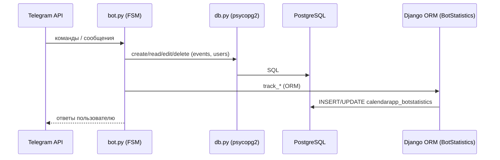

# README_BOT — как работает Telegram-бот календаря

Этот файл описывает **только работу телеграм-бота**: команды, диалоги (FSM), форматы сообщений, запись в БД и учёт статистики. Админ-панель Django, миграции и прочее — в основном `README.md`.

---

## Кратко

* Бот помогает пользователю **создавать, просматривать, редактировать и удалять** события календаря.
* Хранение данных — **PostgreSQL** (таблица `events`), доступ через `db.py`.
* Учёт суточной статистики (новые пользователи, созданные/отредактированные/удалённые события) — через **Django ORM** (модель `BotStatistics`).
* Диалоги построены как **FSM** (многошаговые сценарии), отмена — кнопкой **«Отмена»** или командой `/cancel`.

---

## Файлы бота

* [`bot.py`](./bot.py) — основной сценарий бота (команды, FSM, интеграция со статистикой).
* [`db.py`](./db.py) — соединение с PostgreSQL и CRUD-функции для `users` и `events`.
* [`secrets.py`](./secrets.py) — `API_TOKEN` телеграма (в `.gitignore`).
* [`secrets_example.py`](./secrets_example.py) — образец для создания своего `secrets.py`.

---

## Запуск

Из корня репозитория (рядом с `bot.py`):

```bash
python bot.py
```

Требуется:

* установленный `API_TOKEN` в `secrets.py`;
* доступ к PostgreSQL (см. параметры в `db.py`);
* для статистики: доступны настройки Django (бот сам инициализирует `DJANGO_SETTINGS_MODULE` и подключает модель `BotStatistics`).

---

## Команды

| Команда                    | Назначение                              | Параметры           | Пример                       |
| -------------------------- | --------------------------------------- | ------------------- | ---------------------------- |
| `/start`, `/help`          | краткая справка                         | —                   | `/start`                     |
| `/register`                | регистрация пользователя (идемпотентно) | —                   | `/register`                  |
| `/create_event`            | создать событие (FSM-диалог)            | —                   | `/create_event`              |
| `/display_events`          | показать все события пользователя       | —                   | `/display_events`            |
| `/read_event <id>`         | показать событие по ID                  | `id:int`            | `/read_event 12`             |
| `/edit_event`              | изменить событие (FSM-диалог)           | —                   | `/edit_event`                |
| `/edit_event <id> <текст>` | изменить «одной строкой»                | `id:int, текст:str` | `/edit_event 12 Новый текст` |
| `/delete_event`            | удалить событие (FSM-диалог)            | —                   | `/delete_event`              |
| `/delete_event <id>`       | удалить «одной строкой»                 | `id:int`            | `/delete_event 12`           |
| `/cancel`                  | отмена текущего диалога                 | —                   | `/cancel`                    |

> В диалогах доступна кнопка **«Отмена»** (ReplyKeyboard) — это эквивалент `/cancel`.

---

## Диалоги (FSM)

### Создание события — `/create_event`

Шаги:

1. **WAIT_NAME** → «Введите название события».
2. **WAIT_DATE** → «Введите дату в формате `ГГГГ-ММ-ДД` (например, `2025-12-12`)».
3. **WAIT_TIME** → «Введите время в формате `ЧЧ:ММ` (например, `14:30`)».
4. **WAIT_DETAILS** → «Введите описание события».
5. **INSERT** → запись в БД → ответ `Событие создано. ID: <id>`.

Проверки форматов делаются через `datetime.strptime`. На ошибку форматирования бот просит повторить ввод.

### Редактирование — `/edit_event`

Два режима:

* **Одной строкой:** `/edit_event <id> <новый текст>`
  Успех → «Обновлено.»

* **FSM:**

  1. **WAIT_ID** → запрос ID (число);
  2. **WAIT_NEW_DETAILS** → запрос нового описания;
  3. запись → «Обновлено.»

### Удаление — `/delete_event`

Два режима:

* **Одной строкой:** `/delete_event <id>`
* **FSM:** `WAIT_ID` → удаление → «Удалено.»

### Отмена

* Команда `/cancel` в любой момент.
* Кнопка **«Отмена»** в диалоге.

FSM хранится в памяти процесса (словарь `user_states`):
`user_states[user_id] = {"flow": "...", "step": "...", "data": {...}}`.

---

## Учёт статистики

Бот инкрементирует показатели по дате (сегодня) в модели `BotStatistics`:

* `track_new_user(is_new=True)` — после успешной `/register` (только если пользователь новый);
* `track_event_created()` — после успешного создания события;
* `track_event_edited()` — после успешного редактирования;
* `track_event_cancelled()` — после успешного удаления.

Django-модель `BotStatistics` хранится в таблице `calendarapp_botstatistics` и видна в админке.
Создание/получение строки за сегодня выполняется через `get_or_create(date=today)`.

---

## Взаимодействие с базой

### События

* Таблица: **`events`** (создаётся первой частью проекта).
* Пишет/читает: **бот через `db.py`** (psycopg2).
* Поля (ожидаемый минимум):

  * `id SERIAL PRIMARY KEY`,
  * `name TEXT/VARCHAR`,
  * `date DATE`,
  * `time TIME`,
  * `details TEXT`,
  * `user_id BIGINT` — Telegram-ID владельца.

### Пользователи

* Таблица: **`users`** (минимум `tg_user_id`, `username`, `first_name`).
* `/register` создаёт запись (идемпотентно), проверка через `user_exists()`.

> В админке Django модель `Event` **маппится на эту же таблицу `events`** (`managed=False`, `db_table="events"`, `tg_user_id -> db_column="user_id"`), поэтому админ видит **те же** записи, что создаёт бот.

---

## Логирование

Включено базовое логирование (`logging`) с уровнем `INFO`.
Пишутся ключевые точки: входы в команды, шаги FSM, результаты CRUD.

Примеры сообщений лога:

```
/create_event start user_id=123456
FSM CREATE user_id=123456 step=WAIT_TIME msg=12:12
STAT: event_count +=1
```

---

## Примеры взаимодействия

**Создание события (диалог):**

```
/create_event
→ Введите название события:
встреча
→ Введите дату в формате ГГГГ-ММ-ДД:
2025-12-12
→ Введите время в формате ЧЧ:ММ:
12:12
→ Введите описание события:
планёрка
→ Событие создано. ID: 2
```

**Редактирование одной строкой:**

```
/edit_event 2 Обновлённое описание
→ Обновлено.
```

**Удаление (диалог):**

```
/delete_event
→ Введите ID события для удаления:
2
→ Удалено.
```

**Просмотр:**

```
/display_events
→ [ID: 1] встреча — 2025-12-10 10:00
   ...
```

---

## Архитектура (упрощённо)



---

## Валидации и ограничения

* **Дата:** `YYYY-MM-DD` (например, `2025-12-12`).
* **Время:** `HH:MM` (например, `09:05`).
* ID — только **целое** число.
* Ограничения на длины строк — в `db.py`/БД (рекомендуется `name <= 255`).
* **Часовой пояс:** используется системный; хранение даты/времени — как переданы.

---

## Обработка ошибок

* Неверные форматы даты/времени → просьба повторить ввод.
* Ошибки БД → короткое понятное сообщение («Не удалось создать событие»).
* При отсутствии регистрации → подсказка выполнить `/register`.
* В FSM в любой момент можно `Отмена`/`/cancel`.

---

## Добавление своей команды

1. Создайте функцию-обработчик в `bot.py` (с докстрингом).
2. Зарегистрируйте хендлер:

   ```python
   dispatcher.add_handler(CommandHandler("mycmd", mycmd_handler))
   ```
3. Добавьте в меню:

   ```python
   updater.bot.set_my_commands([... , BotCommand("mycmd", "Описание")])
   ```
4. При необходимости — новую таблицу/CRUD в `db.py`.

---

## Тестирование

* Команды без параметров и с параметрами (оба сценария).
* Неверный формат даты/времени.
* Отмена на каждом шаге FSM.
* Регистрация повторно (идемпотентность).
* Создание/редактирование/удаление с проверкой, что изменения видны в `/display_events` и в админке.
* Статистика: после `/register`, создания, редактирования, удаления — увеличиваются соответствующие счётчики за сегодняшнюю дату.

---

## Частые вопросы

**Почему админка видит «старые» события из бота?**
Потому что модель `Event` в Django привязана к той же таблице `events` (`managed=False`, `db_table="events"`).

**Можно ли перенести все операции с событиями на Django ORM?**
Да, но это изменит задание. В текущей учебной архитектуре события пишутся низкоуровневым SQL (первая часть), а статистика — через ORM (вторая часть).

**Где хранятся токены?**
В `secrets.py`. Не коммитим. Шаблон — `secrets_example.py`.

---
