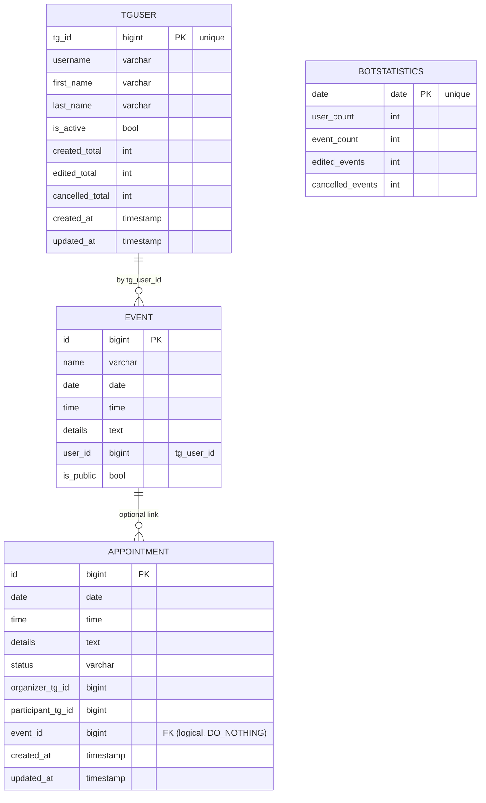

````md
# README_DJANGO — веб-панель, ORM, встречи, публичные события и экспорт

Документ описывает **только Django-часть** проекта: модели данных, миграции,
админ-панель, настройки, базовые вьюхи/urls, утилиты (встречи, экспорт),
а также интеграцию с общей БД (PostgreSQL). Работа телеграм-бота — в `README_BOT.md`.
Общий обзор — в `README.md`. Основа файла была расширена и обновлена под задачи 4–6.  

---

## Оглавление

- [Назначение и ключевые возможности](#назначение-и-ключевые-возможности)
- [Архитектура Django-части](#архитектура-django-части)
- [Стек технологий](#стек-технологий)
- [Инструменты и документация](#инструменты-и-документация)
- [Требования](#требования)
- [Установка и конфигурация](#установка-и-конфигурация)
  - [Создание БД и пользователя](#создание-бд-и-пользователя)
  - [Настройка `settings.py`](#настройка-settingspy)
  - [Проверка установленных приложений](#проверка-установленных-приложений)
- [Миграции и первичный запуск](#миграции-и-первичный-запуск)
- [Запуск dev-сервера](#запуск-dev-сервера)
- [Структура Django-проекта](#структура-django-проекта)
- [Модели данных](#модели-данных)
  - [Модель `Event` (read-only через ORM)](#модель-event-read-only-через-orm)
  - [Модель `TgUser` (личные кабинеты)](#модель-tguser-личные-кабинеты)
  - [Модель `BotStatistics`](#модель-botstatistics)
  - [Модель `Appointment` (встречи)](#модель-appointment-встречи)
- [Утилиты (`calendarapp/utils.py`)](#утилиты-calendarapputilspy)
  - [Занятость и создание приглашения](#занятость-и-создание-приглашения)
  - [Экспорт: токены и полезные данные](#экспорт-токены-и-полезные-данные)
- [Админ-панель: список, фильтры, поиск, инлайны](#админ-панель-список-фильтры-поиск-инлайны)
- [Вьюхи и маршруты](#вьюхи-и-маршруты)
  - [Healthcheck](#healthcheck)
  - [Экспорт CSV/JSON](#экспорт-csvjson)
- [Интеграция с телеграм-ботом](#интеграция-с-телеграм-ботом)
  - [Общий поток данных (Event)](#общий-поток-данных-event)
  - [Общий поток данных (Appointment)](#общий-поток-данных-appointment)
  - [Синхронизация пользователей (TgUser)](#синхронизация-пользователей-tguser)
- [ORM-примеры в Django shell](#orm-примеры-в-django-shell)
- [Расширение: задел под REST API (DRF)](#расширение-задел-под-rest-api-drf)
- [Безопасность и секреты](#безопасность-и-секреты)
- [Продакшн-заметки](#продакшн-заметки)
- [Типичные проблемы и решения](#типичные-проблемы-и-решения)
- [Чек-лист перед PR](#чек-лист-перед-pr)
- [Приложение A: ER-диаграмма (Mermaid)](#приложение-a-er-диаграмма-mermaid)

---

## Назначение и ключевые возможности

- **Админ-панель Django** для просмотра и управления календарными данными:
  - реальные **события** пользователей из таблицы `events` (в неё пишет бот);
  - **личные кабинеты** пользователей Telegram (`TgUser`) + счётчики активности;
  - **встречи** между пользователями (`Appointment`) со статусами и проверкой занятости;
  - **суточная статистика** бота (`BotStatistics`).
- **Публичные события**: флаг `is_public` в `events`, чтобы делиться своими событиями.
- **Экспорт** своих событий в **CSV/JSON** через защищённую ссылку (подписанный токен + TTL).
- **ORM-слой** для пользователей/встреч/статистики; `Event` маппится на существующую таблицу (`managed=False`).
- Мини-вьюхи и маршруты, единая PostgreSQL для бота и Django.

---

## Архитектура Django-части

- Проект `webapp/`:
  - пакет `webapp/webapp/` — настройки, корневые urls, WSGI-вход;
  - приложение `webapp/calendarapp/` — модели, админка, утилиты, urls/views.
- Бот работает с `events` напрямую (psycopg2, см. `db.py`).
- Django читает те же события через модель `Event` (`managed=False`, `db_table="events"`), а также ведёт `TgUser`, `Appointment`, `BotStatistics` через ORM и миграции.

---

## Стек технологий

- **Python 3.11–3.13**
- **Django 5.x** (Admin, ORM, миграции)
- **PostgreSQL 14–16**
- **psycopg2 / psycopg2-binary**
- **Django REST Framework** (задел под API)
- **logging** (единый стиль логов)

---

## Инструменты и документация

- Django — https://docs.djangoproject.com/
- Django Admin — https://docs.djangoproject.com/en/stable/ref/contrib/admin/
- Django ORM — https://docs.djangoproject.com/en/stable/topics/db/models/
- PostgreSQL — https://www.postgresql.org/docs/
- psycopg2 — https://www.psycopg.org/docs/
- Python — https://docs.python.org/3/

---

## Требования

- **Система**: Python 3.11+, PostgreSQL 14+, свободный порт 8000.
- **Браузер**: Chrome/Edge/Firefox (последние), Safari 16+.

---

## Установка и конфигурация

### Создание БД и пользователя

```sql
CREATE DATABASE calendar_db;
CREATE USER calendar_user WITH PASSWORD 'strong_password';
GRANT ALL PRIVILEGES ON DATABASE calendar_db TO calendar_user;

GRANT USAGE ON SCHEMA public TO calendar_user;
GRANT ALL ON ALL TABLES IN SCHEMA public TO calendar_user;
ALTER DEFAULT PRIVILEGES IN SCHEMA public GRANT ALL ON TABLES TO calendar_user;
````

### Настройка `settings.py`

Файл: [`webapp/webapp/settings.py`](./webapp/webapp/settings.py)

```python
DATABASES = {
    "default": {
        "ENGINE": "django.db.backends.postgresql",
        "NAME": "calendar_db",
        "USER": "calendar_user",
        "PASSWORD": "calendar_password",
        "HOST": "localhost",
        "PORT": "5432",
    }
}

INSTALLED_APPS = [
    # ...
    "calendarapp",
    # ...
    "rest_framework",  # опционально (задел под API)
]

# Экспорт (Task 6)
EXPORT_TOKEN_MAX_AGE = 900  # сек, по умолчанию 15 минут
```

Важно: `TIME_ZONE = "Europe/Moscow"`, `USE_TZ = True` — хранение в UTC, отображение локально.
Не забыть `__init__.py` в пакетах.

### Проверка установленных приложений

[`webapp/calendarapp/apps.py`](./webapp/calendarapp/apps.py):

```python
class CalendarappConfig(AppConfig):
    name = "calendarapp"
    verbose_name = "Календарь / Бот"
```

---

## Миграции и первичный запуск

Из корня репозитория:

```bash
python webapp/manage.py migrate
python webapp/manage.py createsuperuser
```

* `migrate` создаст таблицы для `TgUser`, `BotStatistics` и `Appointment`.
* Таблица `events` **не** создаётся миграциями Django — она уже есть (её наполняет бот).
  Для неё используется `managed=False` в модели `Event`.

---

## Запуск dev-сервера

Из **корня**:

```bash
python webapp/manage.py runserver
# Главная:  http://127.0.0.1:8000/
# Админка:  http://127.0.0.1:8000/admin/
```

> Запуск из корня обеспечивает корректный `PYTHONPATH` и резолвинг модулей.

---

## Структура Django-проекта

```text
webapp/
├─ manage.py
├─ webapp/
│  ├─ __init__.py
│  ├─ settings.py
│  ├─ urls.py                # /admin, / (include calendarapp.urls)
│  └─ wsgi.py
└─ calendarapp/
   ├─ __init__.py
   ├─ apps.py
   ├─ admin.py
   ├─ models.py              # Event (managed=False, is_public), TgUser, BotStatistics, Appointment
   ├─ utils.py               # занятость/инвайт, токены экспорта, полезные сборки данных
   ├─ urls.py                # healthcheck, export/<str:fmt>/
   ├─ views.py               # healthcheck, export_events
   └─ migrations/
```

Ключевые файлы:

* `webapp/calendarapp/models.py`
* `webapp/calendarapp/admin.py`
* `webapp/calendarapp/utils.py`
* `webapp/calendarapp/views.py`
* `webapp/webapp/settings.py`

---

## Модели данных

Файл: [`webapp/calendarapp/models.py`](./webapp/calendarapp/models.py)

### Модель `Event` (read-only через ORM)

* Маппит **существующую** таблицу `events`, куда пишет бот (через SQL в `db.py`).
* Важное:

  * `class Meta: managed = False`
  * `db_table = "events"`
  * поле модели `tg_user_id` → колонка `user_id` (`db_column="user_id"`).
  * **Новое:** `is_public: BooleanField` — флаг публикации события.
* Поля: `id`, `name`, `date`, `time`, `details`, `tg_user_id (user_id)`, `is_public`.

> Запись/изменение `events` выполняет бот; Django модель используется для чтения, списков в админке и связанных операций (встречи, экспорт).

### Модель `TgUser` (личные кабинеты)

* Профиль пользователя Telegram и **персональные счётчики** активности.
* Поля (основные): `tg_id (unique)`, `username`, `first_name`, `last_name`, `is_active`,
  `created_total`, `edited_total`, `cancelled_total`, `created_at`, `updated_at`.
* Инлайн-события пользователя в админке (по `tg_user_id`).

### Модель `BotStatistics`

* Суточные метрики, которые обновляются ботом:

  * `date (unique)`, `user_count`, `event_count`, `edited_events`, `cancelled_events`.

### Модель `Appointment` (встречи)

* `event: FK(Event)` с `DO_NOTHING` и `db_constraint=False` (логическая связь к внешней таблице).
* `organizer_tg_id`, `participant_tg_id`, `date`, `time`, `details`, `status` (`pending|confirmed|declined|cancelled`).
* Индексы по `status` и TG-ID для быстрого поиска.

---

## Утилиты (`calendarapp/utils.py`)

### Занятость и создание приглашения

```python
def get_user_busy_slots(tg_user_id, date_from=None, date_to=None) -> list[tuple]:
    """[(date, time, appt_id, status), ...] — pending/confirmed слоты."""

def is_user_free(tg_user_id, meet_date, meet_time) -> bool:
    """True, если нет пересечений с pending/confirmed."""

@transaction.atomic
def create_pending_invite_for_event(organizer_tg_id, participant_tg_id, event, details=""):
    """
    Если участник свободен — создаёт Appointment(status=PENDING),
    иначе возвращает (None, "busy").
    """
```

### Экспорт: токены и полезные данные

```python
def make_export_token(tg_user_id: int) -> str:
    """Подписанный токен (signing.dumps), включает tg_user_id."""

def verify_export_token(token: str, max_age: int) -> int:
    """Проверка подписи и TTL (возвращает tg_user_id, иначе ValueError)."""

def get_user_events_payload(tg_user_id: int) -> list[dict]:
    """Список словарей событий пользователя (id, name, date, time, details, tg_user_id)."""
```

> TTL берётся из `settings.EXPORT_TOKEN_MAX_AGE` (по умолчанию 900 сек).

---

## Админ-панель: список, фильтры, поиск, инлайны

[`webapp/calendarapp/admin.py`](./webapp/calendarapp/admin.py)

* **EventAdmin**

  * `list_display = ("id", "name", "date", "time", "tg_user_id", "is_public")`
  * `list_filter = ("date", "is_public")`
  * `search_fields = ("name", "details", "tg_user_id")`
* **TgUserAdmin**

  * `list_display = ("tg_id", "username", "is_active", "created_total", "edited_total", "cancelled_total", "created_at")`
  * `search_fields = ("tg_id", "username", "first_name", "last_name")`
  * inline событий пользователя (read-only) по `tg_user_id`.
* **BotStatisticsAdmin**

  * `list_display = ("date", "user_count", "event_count", "edited_events", "cancelled_events")`
  * `list_filter = ("date",)`
* **AppointmentAdmin**

  * `list_display = ("id", "date", "time", "status", "organizer_tg_id", "participant_tg_id", "event")`
  * `list_filter = ("status", "date")`
  * `search_fields = ("details", "organizer_tg_id", "participant_tg_id")`

---

## Вьюхи и маршруты

### Healthcheck

* `calendarapp.views.healthcheck` → простой ответ `"Calendar WebApp is running."`
* `calendarapp.urls`: `path("", views.healthcheck, name="healthcheck")`

### Экспорт CSV/JSON

* Эндпоинт: `path("export/<str:fmt>/", views.export_events, name="export_events")`
* `fmt` ∈ `{ "csv", "json" }`
* Квери-параметр: `token=...` (подписанный токен, несущий `tg_user_id`)
* Алгоритм:

  1. `verify_export_token(token, max_age=settings.EXPORT_TOKEN_MAX_AGE)` → `tg_user_id`
  2. `get_user_events_payload(tg_user_id)` — список событий владельца
  3. Отдача CSV/JSON (UTF-8), корректные `Content-Type` и `Content-Disposition`

---

## Интеграция с телеграм-ботом

### Общий поток данных (Event)

1. Бот создаёт записи в `events` (`db.py`, psycopg2).
2. Django-модель `Event(managed=False)` отражает эти записи.
3. `/calendar` в боте показывает события и **кнопки экспорта** (ссылка на Django).
4. Экспорт доступен **только владельцу**, потому что ссылка содержит подписанный токен с его `tg_user_id`.

### Общий поток данных (Appointment)

1. Бот собирает данные (участник, событие, комментарий), проверяет занятость.
2. `utils.create_pending_invite_for_event(...)` создаёт ORM-запись, если всё ок.
3. Подтверждение/отклонение идёт через бот, статус обновляется в БД.

### Синхронизация пользователей (TgUser)

1. При `/login` бот создаёт/обновляет `TgUser` (привязка Telegram → Django).
2. В админке у пользователя видны инлайн-события и счётчики.

---

## ORM-примеры в Django shell

```bash
python webapp/manage.py shell
```

```python
from calendarapp.models import Event, TgUser, BotStatistics, Appointment
from calendarapp.utils import get_user_busy_slots, is_user_free, make_export_token, verify_export_token, get_user_events_payload
from django.conf import settings
from datetime import date, time

# События владельца (по Telegram ID)
Event.objects.filter(tg_user_id=123456789).order_by("date", "time")[:20]

# Профиль и счётчики
u, _ = TgUser.objects.get_or_create(tg_id=123456789)
u.created_total, u.edited_total, u.cancelled_total

# Проверка занятости / создание встречи
is_user_free(987654321, date(2025,12,12), time(12,12))
get_user_busy_slots(987654321)

# Экспортный токен
tok = make_export_token(123456789)
tg_id = verify_export_token(tok, settings.EXPORT_TOKEN_MAX_AGE)
payload = get_user_events_payload(tg_id)
```

---

## Расширение: задел под REST API (DRF)

* `calendarapp/api/serializers.py` — сериализаторы
* `calendarapp/api/views.py` — вьюсеты
* `calendarapp/api/urls.py` — роутер DRF
* Подключение: `path("api/", include("calendarapp.api.urls"))`
* Аутентификация/разрешения — по требованиям (Token/Auth, IsAuthenticated, Object-level perms)

---

## Безопасность и секреты

* Не создавайте в корне пользовательский `secrets.py` — он перекроет стандартный модуль и сломает CSRF/логин. Секреты бота — `bot_secrets.py` (в `.gitignore`).
* Для продакшена:

  * `DEBUG = False`, корректный `ALLOWED_HOSTS`
  * секреты из env: `SECRET_KEY`, креды БД
  * ограничение доступа к `/admin`, сильные пароли, при необходимости 2FA
* Экспорт:

  * токен подписан `SECRET_KEY` и действителен `EXPORT_TOKEN_MAX_AGE` секунд
  * токен не хранится в БД, не раскрывает приватные данные

---

## Продакшн-заметки

* WSGI: `webapp/webapp/wsgi.py`
* Сервер: `gunicorn`/`uWSGI`
* Статика:
  `STATIC_ROOT = BASE_DIR / "staticfiles"`,
  `python webapp/manage.py collectstatic`,
  отдача через Nginx или `whitenoise`
* Окружение:
  `DJANGO_SETTINGS_MODULE=webapp.settings`, переменные окружения для БД/секретов
* Миграции — до старта приложения

---

## Типичные проблемы и решения

* **`ModuleNotFoundError: No module named 'calendarapp'` при `runserver`**
  Запускайте из корня: `python webapp/manage.py runserver`. Проверьте `INSTALLED_APPS`, `apps.py (name="calendarapp")`, `__init__.py`.

* **500 на `/admin/login/` + `secrets.choice`**
  В корне лежал файл `secrets.py`. Переименуйте свои секреты в `bot_secrets.py`. Очистите `__pycache__`.

* **`psycopg2.errors.InsufficientPrivilege` при миграциях**
  Выдайте права пользователю БД (см. «Создание БД и пользователя»).

* **`FieldError: Cannot resolve keyword 'tg_user_id'`**
  Проверьте маппинг поля: в `Event` атрибут `tg_user_id` маппится на колонку `user_id` (`db_column="user_id"`). В ORM-фильтрах используйте `tg_user_id=...`.

* **Экспорт 403/400**
  Неверный/просроченный токен, либо отсутствует `EXPORT_TOKEN_MAX_AGE`. Проверьте настройки и заново сформируйте ссылку из бота.

* **Публичные события не отображаются**
  Убедитесь, что бот проставил `is_public=True` в `events` и фильтры в ORM учитывают флаг.

---

## Чек-лист перед PR

* [ ] `python webapp/manage.py runserver` — ок
* [ ] `/admin` доступен, суперпользователь входит
* [ ] **TgUser** отображаются; счётчики обновляются
* [ ] **Event** показывает реальные записи `events` (в т.ч. `is_public`)
* [ ] **Appointment** видны; фильтры по `status/date` работают
* [ ] **BotStatistics** создаются/видны; уникальность по `date`
* [ ] `calendarapp/urls.py` содержит `export/<str:fmt>/`
* [ ] `views.export_events` проверяет токен и отдаёт CSV/JSON
* [ ] `utils.make_export_token/verify_export_token/get_user_events_payload` присутствуют
* [ ] `settings.EXPORT_TOKEN_MAX_AGE` задан (или используется значение по умолчанию)

---

## Приложение A: ER-диаграмма (Mermaid)



---