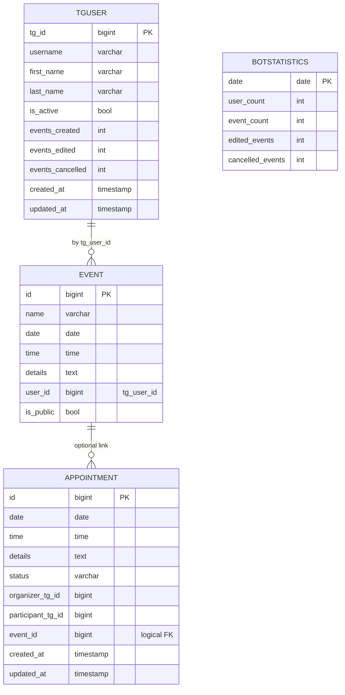

Вот полностью обновлённый **README_DJANGO.md** — можно целиком заменить файл.

````md
# README_DJANGO — веб-панель, ORM, экспорт, REST API и тесты

Этот документ описывает **Django-часть** проекта: модели данных, миграции, админ-панель, вьюхи/urls, задел и реализацию REST API (DRF), а также автоматические тесты (pytest). Телеграм-бот описан в `README_BOT.md`, общий обзор — в `README.md`. В основе — предыдущая версия файла, расширенная под задания **№7 (API)** и **№9 (тесты)**. :contentReference[oaicite:0]{index=0}

---

## Оглавление

- [Назначение и ключевые возможности](#назначение-и-ключевые-возможности)
- [Архитектура Django-части](#архитектура-django-части)
- [Стек технологий](#стек-технологий)
- [Требования](#требования)
- [Установка и конфигурация](#установка-и-конфигурация)
  - [Создание БД и пользователя](#создание-бд-и-пользователя)
  - [Настройка settings.py](#настройка-settingspy)
  - [Проверка приложений](#проверка-приложений)
- [Миграции и первичный запуск](#миграции-и-первичный-запуск)
- [Запуск dev-сервера](#запуск-dev-сервера)
- [Структура Django-проекта](#структура-django-проекта)
- [Модели данных](#модели-данных)
  - [Event (read-only через ORM)](#event-read-only-через-orm)
  - [TgUser (личные кабинеты)](#tguser-личные-кабинеты)
  - [BotStatistics](#botstatistics)
  - [Appointment (встречи)](#appointment-встречи)
- [Утилиты (`calendarapp/utils.py`)](#утилиты-calendarapputilspy)
  - [Занятость и инвайт](#занятость-и-инвайт)
  - [Экспорт: токены и полезные данные](#экспорт-токены-и-полезные-данные)
- [Админ-панель](#админ-панель)
- [Вьюхи и маршруты (Healthcheck, Export)](#вьюхи-и-маршруты-healthcheck-export)
- [REST API](#rest-api-задание-7)
  - [Установка DRF](#установка-drf)
  - [Эндпоинты и примеры](#эндпоинты-и-примеры)
  - [Маршрутизация](#маршрутизация)
  - [Примечания по безопасности](#примечания-по-безопасности)
- [Тесты](#тесты-задание-9)
  - [Установка pytest](#установка-pytest)
  - [Запуск тестов](#запуск-тестов)
  - [Что покрыто тестами](#что-покрыто-тестами)
  - [Советы по CI](#советы-по-ci)
- [Интеграция с телеграм-ботом](#интеграция-с-телеграм-ботом)
- [Типичные проблемы и решения](#типичные-проблемы-и-решения)
- [Продакшн-заметки](#продакшн-заметки)
- [Лицензия и автор](#лицензия-и-автор)
- [Приложение A: ER-диаграмма](#приложение-a-er-диаграмма)

---

## Назначение и ключевые возможности

- **Единая админ-панель**:
  - реальные **события** из таблицы `events` (её заполняет бот напрямую);
  - **профили** пользователей (`TgUser`) + счётчики активности;
  - **встречи** (`Appointment`) со статусами и проверкой занятости;
  - **суточная статистика** (`BotStatistics`).
- **Публичные события**: флаг `is_public` в `events`.
- **Экспорт** своих событий в **CSV/JSON** по подписанному токену (TTL).
- **REST API (DRF)**: публичный список событий, базовый CRUD для встреч/пользователей, выдача экспортного токена.
- **Автотесты (pytest)** для критических узлов. Основа и общая логика следуют прежней версии документа. :contentReference[oaicite:1]{index=1}

---

## Архитектура Django-части

- Проект `webapp/`:
  - `webapp/webapp/` — настройки, корневые `urls`, `wsgi`;
  - `webapp/calendarapp/` — модели, админка, утилиты, urls/views (+ `api/` для DRF).
- Бот пишет в `events` через `psycopg2`; Django читает её через модель `Event(managed=False)`. Остальные модели — через миграции. :contentReference[oaicite:2]{index=2}

---

## Стек технологий

- Python 3.11–3.13
- Django 5.x (Admin, ORM, Migrations)
- PostgreSQL 14–16, psycopg2
- Django REST Framework (DRF) — API слой
- pytest + pytest-django — автотесты

---

## Требования

- Python 3.11+
- PostgreSQL 14+
- Браузер: Chrome/Edge/Firefox (последние), Safari 16+

---

## Установка и конфигурация

### Создание БД и пользователя

```sql
CREATE DATABASE calendar_db;
CREATE USER calendar_user WITH PASSWORD 'calendar_password';
GRANT ALL PRIVILEGES ON DATABASE calendar_db TO calendar_user;

GRANT USAGE ON SCHEMA public TO calendar_user;
GRANT ALL ON ALL TABLES IN SCHEMA public TO calendar_user;
ALTER DEFAULT PRIVILEGES IN SCHEMA public GRANT ALL ON TABLES TO calendar_user;
````

### Настройка `settings.py`

Файл: `webapp/webapp/settings.py`

```python
DATABASES = {
    "default": {
        "ENGINE": "django.db.backends.postgresql",
        "NAME": "calendar_db",
        "USER": "calendar_user",
        "PASSWORD": "calendar_password",
        "HOST": "localhost",
        "PORT": "5432",
    }
}

INSTALLED_APPS = [
    # ...
    "calendarapp",
    # REST API
    "rest_framework",
]

# Экспорт (TTL токена в секундах)
EXPORT_TOKEN_MAX_AGE = 900

TIME_ZONE = "Europe/Moscow"
USE_TZ = True
```

> В пакетах обязательно наличие `__init__.py`. 

### Проверка приложений

`webapp/calendarapp/apps.py`:

```python
class CalendarappConfig(AppConfig):
    name = "calendarapp"
    verbose_name = "Календарь / Бот"
}
```

---

## Миграции и первичный запуск

Из корня репозитория:

```bash
python webapp/manage.py migrate
python webapp/manage.py createsuperuser
```

> Миграции создают таблицы для `TgUser`, `BotStatistics`, `Appointment`. Таблица `events` **не мигрируется** (её ведёт бот), она маппится в ORM через `managed=False`. 

---

## Запуск dev-сервера

```bash
cd webapp
python manage.py runserver
# Главная:  http://127.0.0.1:8000/
# Админка:  http://127.0.0.1:8000/admin/
# API (DRF): http://127.0.0.1:8000/api/  (Browsable API)
```

---

## Структура Django-проекта

```
webapp/
├─ manage.py
├─ webapp/
│  ├─ __init__.py
│  ├─ settings.py
│  ├─ urls.py                # /admin, /, include(calendarapp.urls), include(calendarapp.api.urls)
│  └─ wsgi.py
└─ calendarapp/
   ├─ __init__.py
   ├─ apps.py
   ├─ admin.py
   ├─ models.py              # Event(managed=False, is_public), TgUser, BotStatistics, Appointment
   ├─ utils.py               # занятость/инвайты, токены экспорта, сборки данных
   ├─ urls.py                # healthcheck, export/<fmt>/
   ├─ views.py               # healthcheck, export_events (CSV/JSON)
   └─ api/
      ├─ __init__.py
      ├─ serializers.py      # DRF-сериализаторы
      ├─ views.py            # DRF-вьюсеты/представления
      └─ urls.py             # router → /api/...
```

---

## Модели данных

Файл: `webapp/calendarapp/models.py` 

### `Event` (read-only через ORM)

* Отражает **существующую** таблицу `events`, которую заполняет бот.
* `Meta.managed = False`, `db_table = "events"`.
* Маппинг `tg_user_id` → колонка `user_id` (`db_column="user_id"`).
* Поля: `id`, `user (to_field="tg_id", db_column="user_id", db_constraint=False)`, `name`, `date`, `time`, `details`, `is_public`.
* Назначение: чтение/списки/экспорт, не для записи из Django.

### `TgUser` (личные кабинеты)

* Первичный ключ — `tg_id` (BigInteger).
* Атрибуты профиля и **счётчики**: создано/редактировано/отменено.
* В админке — поиск, инлайн событий пользователя. 

### `BotStatistics`

* Суточные агрегаты: `date (unique)`, `user_count`, `event_count`, `edited_events`, `cancelled_events`. 

### `Appointment` (встречи)

* Логическая FK на `Event` (`DO_NOTHING`, `db_constraint=False`).
* Поля: `organizer_tg_id`, `participant_tg_id`, `date`, `time`, `details`, `status` (`pending|confirmed|declined|cancelled`), timestamps.
* Вспом. метод `user_busy_q(tg_user_id: int) -> Q`. 

---

## Утилиты (`calendarapp/utils.py`)

### Занятость и инвайт

```python
get_user_busy_slots(tg_user_id, date_from=None, date_to=None) -> list[tuple]
is_user_free(tg_user_id, meet_date, meet_time) -> bool
create_pending_invite_for_event(organizer_tg_id, participant_tg_id, event, details="")
```

### Экспорт: токены и полезные данные

```python
make_export_token(tg_user_id: int) -> str
verify_export_token(token: str, max_age: int) -> int
get_user_events_payload(tg_user_id: int) -> list[dict]
```

> TTL берётся из `settings.EXPORT_TOKEN_MAX_AGE` (по умолчанию 900 сек). 

---

## Админ-панель

* **EventAdmin**: `list_display=("id","name","date","time","tg_user_id","is_public")`, фильтры по `date/is_public`, поиск по `name/details/tg_user_id`.
* **TgUserAdmin**: отображение счётчиков, поиск по `tg_id/username`.
* **BotStatisticsAdmin**: фильтр по дате.
* **AppointmentAdmin**: столбцы `status/date` и поиск по TG-ID. 

---

## Вьюхи и маршруты (Healthcheck, Export)

* `GET /` → healthcheck: `"Calendar WebApp is running."`
* `GET /export/<fmt>/?token=...` → экспорт событий владельца:

  * `fmt ∈ {csv, json}`
  * токен подписан `SECRET_KEY`, несёт `tg_user_id`, проверяется TTL. 

---

## REST API (Задание №7)

### Установка DRF

```bash
pip install djangorestframework
# в settings.py → INSTALLED_APPS += ["rest_framework"]
```

### Эндпоинты и примеры

> Базовая реализация для интеграции с внешними системами. Для демо сценариев аутентификация упрощена — обратите внимание на раздел «Безопасность» ниже.

1. **Публичные события**
   `GET /api/events/public/` — список `Event` с `is_public=True`.

Параметры запроса:

* `date_from=YYYY-MM-DD`, `date_to=YYYY-MM-DD`
* `search=строка` (по `name/details`)
* пагинация DRF (`?page=`)

Ответ (пример):

```json
[
  {"id": 101, "name": "Демо", "date": "2025-12-01", "time": "10:00:00",
   "details": "", "tg_user_id": 123456789, "is_public": true}
]
```

2. **Профили пользователей (минимум)**
   `GET /api/users/`, `POST /api/users/`
   Создание профиля для привязки Telegram → Django:

```json
POST /api/users/
{"tg_id": 123456789, "username": "misha"}
```

3. **Встречи**
   `GET /api/appointments/` — фильтры: `status`, `organizer_tg_id`, `participant_tg_id`, дата/время.
   `POST /api/appointments/` — создание pending-встречи (с проверкой свободного слота):

```json
POST /api/appointments/
{
  "organizer_tg_id": 111,
  "participant_tg_id": 222,
  "event_id": 101,
  "date": "2025-12-01",
  "time": "12:30:00",
  "details": "краткая встреча"
}
```

Ответ `201 Created`:

```json
{"id": 55, "status": "pending", "...": "..."}
```

4. **Экспорт — токен**
   `POST /api/export/token/` → выдать подписанный токен по `tg_id`:

```json
POST /api/export/token/
{"tg_id": 123456789}

# Ответ:
{"token": "signed-token", "expires_in": 900}
```

> Далее клиент может скачать экспорт:
> `GET /export/json/?token=...` или `GET /export/csv/?token=...`

### Маршрутизация

`webapp/webapp/urls.py`:

```python
urlpatterns = [
    path("admin/", admin.site.urls),
    path("", include("calendarapp.urls")),
    path("api/", include("calendarapp.api.urls")),  # DRF
]
```

`calendarapp/api/urls.py` (пример):

```python
router = DefaultRouter()
router.register("events/public", PublicEventViewSet, basename="public-events")
router.register("users", TgUserViewSet)
router.register("appointments", AppointmentViewSet)

urlpatterns = [
    path("", include(router.urls)),
    path("export/token/", ExportTokenView.as_view()),
]
```

> Сериализаторы/вьюсеты — в `calendarapp/api/serializers.py`, `calendarapp/api/views.py`.

### Примечания по безопасности

* Для реальной эксплуатации:

  * включить аутентификацию (Token/OAuth/JWT), `IsAuthenticated`;
  * ограничить выдачу экспортных токенов только владельцу;
  * rate-limit на чувствительных эндпоинтах;
  * валидация входных данных и object-level permissions.

---

## Тесты

### Установка pytest

```bash
pip install pytest pytest-django
```

В `pytest.ini` указать:

```ini
[pytest]
DJANGO_SETTINGS_MODULE = webapp.settings
python_files = tests/test_*.py
```

### Запуск тестов

Из корня:

```bash
pytest --reuse-db -q
```

> На типовой машине вывод тестов: **6 passed** (возможны предупреждения сторонних пакетов).
> При первом запуске без `--reuse-db` pytest-django создаёт тестовую БД.

### Что покрыто тестами

* **Экспорт**: JSON и CSV (заголовки, кодировка, минимальная структура).
* **Handlers (бот-события) в упрощённом контексте**: help/start ответ.
* **Модели**: базовые операции `TgUser`, `Appointment`, инкременты статистики.

Цель — регрессия критических узлов без избыточной хрупкости.

### Советы по CI

* Кэшировать виртуальное окружение и `--reuse-db`.
* Для PostgreSQL в CI — роль с правами на создание тестовой БД либо стратегия `keepdb`.

---

## Интеграция с телеграм-ботом

* **Поток Event**: бот пишет в `events` (SQL), Django читает через модель `Event(managed=False)`; экспорт выдаётся через Django ссылками из бота.
* **Поток Appointment**: бот собирает ввод → вызывает utils для проверки занятости → пишет через ORM.
* **Синхронизация TgUser**: при логине/командах бот создаёт/обновляет профиль в Django. 

---

## Типичные проблемы и решения

* `ModuleNotFoundError: 'calendarapp'` → запускать из корня (`python webapp/manage.py runserver`), проверить `INSTALLED_APPS`, `apps.py`, `__init__.py`.
* `psycopg2.errors.InsufficientPrivilege` на тестах → выдать права пользователю БД или использовать `--reuse-db`.
* Экспорт даёт 400/403 → истёк/неверен токен; заново запросить через API/бота.
* `FieldError: Cannot resolve keyword 'tg_user_id'` → помнить, что это поле маппится на колонку `user_id` (`db_column`), фильтровать по `tg_user_id`. 

---

## Продакшн-заметки

* `DEBUG=False`, `ALLOWED_HOSTS`, секреты из ENV.
* Сервис статики: `collectstatic` + Nginx/Whitenoise.
* WSGI: `gunicorn`/`uWSGI`; миграции — до старта приложения.

---

## Лицензия и автор

* Лицензия: MIT (при необходимости уточнить корпоративную политику).
* Автор/контакт: укажите ФИО и e-mail владельца проекта.

---

## Приложение A: ER-диаграмма

