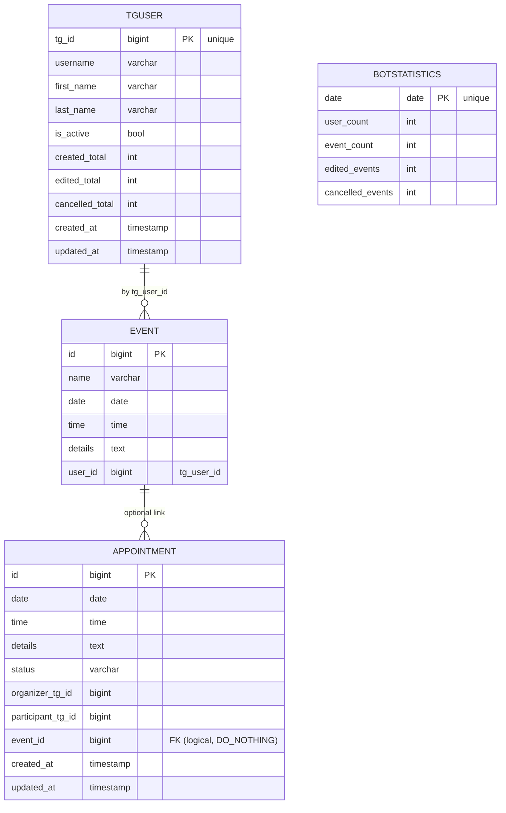

````md
# README_DJANGO — веб-панель, ORM и встречи (Appointment)

Документ описывает **только Django-часть** проекта: модели данных, миграции,
админ-панель, настройки, базовые вьюхи/urls, утилиты для встреч (Appointment)
и интеграцию с общей БД (PostgreSQL). Работа телеграм-бота — в `README_BOT.md`.
Общий обзор — в `README.md`.

---

## Оглавление

- [Назначение и ключевые возможности](#назначение-и-ключевые-возможности)
- [Архитектура Django-части](#архитектура-django-части)
- [Стек технологий](#стек-технологий)
- [Инструменты и документация](#инструменты-и-документация)
- [Требования](#требования)
- [Установка и конфигурация](#установка-и-конфигурация)
  - [Создание БД и пользователя](#создание-бд-и-пользователя)
  - [Настройка `settings.py`](#настройка-settingspy)
  - [Проверка установленных приложений](#проверка-установленных-приложений)
- [Миграции и первичный запуск](#миграции-и-первичный-запуск)
- [Запуск dev-сервера](#запуск-dev-сервера)
- [Структура Django-проекта](#структура-django-проекта)
- [Модели данных](#модели-данных)
  - [Модель `Event` (read-only через ORM)](#модель-event-read-only-через-orm)
  - [Модель `TgUser` (личные кабинеты)](#модель-tguser-личные-кабинеты)
  - [Модель `BotStatistics`](#модель-botstatistics)
  - [Модель `Appointment` (встречи)](#модель-appointment-встречи)
- [Утилиты встреч (`calendarapp/utils.py`)](#утилиты-встреч-calendarapputilspy)
- [Админ-панель: список, фильтры, поиск, инлайны](#админ-панель-список-фильтры-поиск-инлайны)
- [Вьюхи и маршруты](#вьюхи-и-маршруты)
- [Интеграция с телеграм-ботом](#интеграция-с-телеграм-ботом)
  - [Общий поток данных (Event)](#общий-поток-данных-event)
  - [Общий поток данных (Appointment)](#общий-поток-данных-appointment)
  - [Синхронизация пользователей (TgUser)](#синхронизация-пользователей-tguser)
- [ORM-примеры: запросы в Django shell](#orm-примеры-запросы-в-django-shell)
- [Расширение: задел под REST API (DRF)](#расширение-задел-под-rest-api-drf)
- [Безопасность и секреты](#безопасность-и-секреты)
- [Продакшн-заметки (WSGI, статика, окружение)](#продакшн-заметки-wsgi-статика-окружение)
- [Типичные проблемы и решения](#типичные-проблемы-и-решения)
- [Чек-лист перед PR](#чек-лист-перед-pr)
- [Приложение A: ER-диаграмма (Mermaid)](#приложение-a-er-диаграмма-mermaid)

---

## Назначение и ключевые возможности

- **Админ-панель Django** для просмотра и управления данными календаря:
  - реальные события пользователей из таблицы `events` (в неё пишет бот);
  - модель пользователей Telegram `TgUser` (личные кабинеты + счётчики активности);
  - суточная **статистика бота** (`BotStatistics`);
  - **встречи между пользователями** (`Appointment`) со статусами и временными слотами.
- **ORM-слой** для статистики, встреч и пользователей. События маппятся на существующую таблицу (`managed=False`).
- **Мини-вьюха** `healthcheck` и корневой роутинг.
- **Единая PostgreSQL** для бота и Django — целостные общие данные.

---

## Архитектура Django-части

- Проект `webapp/` содержит:
  - пакет `webapp/webapp/` — настройки, корневые urls, WSGI-вход;
  - приложение `webapp/calendarapp/` — модели, админка, утилиты, URLs/views.
- Телеграм-бот пишет **события** напрямую в таблицу `events` через `psycopg2` (см. `db.py`).
- Django:
  - читает те же события через модель `Event` (`managed=False`, `db_table="events"`);
  - ведёт `TgUser`, `BotStatistics` и `Appointment` через миграции и ORM.

---

## Стек технологий

- **Python 3.11–3.13**
- **Django 5.x** (Admin, ORM, миграции)
- **PostgreSQL 14–16**
- **psycopg2 / psycopg2-binary**
- **Django REST Framework** (задел под API)

---

## Инструменты и документация

- Django — https://docs.djangoproject.com/
- Django Admin — https://docs.djangoproject.com/en/stable/ref/contrib/admin/
- Django ORM — https://docs.djangoproject.com/en/stable/topics/db/models/
- PostgreSQL — https://www.postgresql.org/docs/
- psycopg2 — https://www.psycopg.org/docs/
- Python — https://docs.python.org/3/

---

## Требования

- **Система**: Python 3.11+, PostgreSQL 14+, свободный порт 8000.
- **Браузер**: Chrome/Edge/Firefox (последние), Safari 16+.

---

## Установка и конфигурация

### Создание БД и пользователя

```sql
CREATE DATABASE calendar_db;
CREATE USER calendar_user WITH PASSWORD 'strong_password';
GRANT ALL PRIVILEGES ON DATABASE calendar_db TO calendar_user;

-- (рекомендуется) права на схему/таблицы:
GRANT USAGE ON SCHEMA public TO calendar_user;
GRANT ALL ON ALL TABLES IN SCHEMA public TO calendar_user;
ALTER DEFAULT PRIVILEGES IN SCHEMA public GRANT ALL ON TABLES TO calendar_user;
````

### Настройка `settings.py`

Файл: [`webapp/webapp/settings.py`](./webapp/webapp/settings.py)

```python
DATABASES = {
    "default": {
        "ENGINE": "django.db.backends.postgresql",
        "NAME": "calendar_db",
        "USER": "calendar_user",
        "PASSWORD": "calendar_password",
        "HOST": "localhost",
        "PORT": "5432",
    }
}

INSTALLED_APPS = [
    # ...
    "calendarapp",
    # ...
    "rest_framework",
]
```

Обязательно:

* `TIME_ZONE = "Europe/Moscow"`, `USE_TZ = True` — хранение в UTC, отображение локально.
* В пакетах есть `__init__.py`.

### Проверка установленных приложений

В [`webapp/calendarapp/apps.py`](./webapp/calendarapp/apps.py):

```python
class CalendarappConfig(AppConfig):
    name = "calendarapp"
    verbose_name = "Календарь / Бот"
```

---

## Миграции и первичный запуск

Из корня репозитория:

```bash
python webapp/manage.py migrate
python webapp/manage.py createsuperuser
```

* `migrate` создаст таблицы для `TgUser`, `BotStatistics` и `Appointment`.
* Таблица `events` **не** создаётся миграциями Django — она уже есть (её наполняет бот).
  Для неё используется `managed=False` в модели `Event`.

---

## Запуск dev-сервера

Из **корня**:

```bash
python webapp/manage.py runserver
# Главная:  http://127.0.0.1:8000/
# Админка:  http://127.0.0.1:8000/admin/
```

> Запуск из корня обеспечивает корректный `PYTHONPATH` и резолвинг модулей.

---

## Структура Django-проекта

```text
webapp/
├─ manage.py                     # CLI Django
├─ webapp/
│  ├─ __init__.py               # описание пакета проекта
│  ├─ settings.py               # БД, INSTALLED_APPS, локаль, статика
│  ├─ urls.py                   # /admin, корневой include для calendarapp
│  └─ wsgi.py                   # WSGI-точка
└─ calendarapp/
   ├─ __init__.py               # описание пакета приложения
   ├─ apps.py                   # AppConfig(name='calendarapp')
   ├─ admin.py                  # админка: Event, TgUser (inline Events), BotStatistics, Appointment
   ├─ models.py                 # Event (managed=False), TgUser, BotStatistics, Appointment
   ├─ utils.py                  # занятость, проверка слотов, создание приглашений
   ├─ urls.py                   # healthcheck
   ├─ views.py                  # healthcheck
   └─ migrations/
      ├─ 0001_initial.py
      └─ 0002_*.py
```

Ключевые файлы:

* [`webapp/calendarapp/models.py`](./webapp/calendarapp/models.py)
* [`webapp/calendarapp/admin.py`](./webapp/calendarapp/admin.py)
* [`webapp/calendarapp/utils.py`](./webapp/calendarapp/utils.py)
* [`webapp/webapp/settings.py`](./webapp/webapp/settings.py)

---

## Модели данных

Файл: [`webapp/calendarapp/models.py`](./webapp/calendarapp/models.py)

### Модель `Event` (read-only через ORM)

* Маппит **существующую** таблицу `events`, куда пишет бот (через чистый SQL).
* Важное:

  * `class Meta: managed = False` — Django не управляет таблицей;
  * `db_table = "events"`;
  * поле модели `tg_user_id` → колонка `user_id` (`db_column="user_id"`).
* Поля:

  * `id: BigAutoField (PK)`
  * `name: CharField(255)`
  * `date: DateField`
  * `time: TimeField`
  * `details: TextField`
  * `tg_user_id: BigIntegerField(db_column="user_id")`
* Назначение: **чтение** событий в админке и через ORM; запись — стороной бота.

### Модель `TgUser` (личные кабинеты)

* Хранит профиль пользователя Telegram и его **персональные счётчики** активности.
* Используется ботом для привязки через `/login` и для учёта действий.
* Поля (основные):

  * `tg_id: BigIntegerField(index=True, unique=True)` — Telegram ID
  * `username: CharField(null=True, blank=True)`
  * `first_name`, `last_name: CharField(null=True, blank=True)`
  * `is_active: BooleanField(default=True)`
  * `created_total`, `edited_total`, `cancelled_total: PositiveIntegerField(default=0)`
  * `created_at: DateTimeField(auto_now_add=True)`, `updated_at: DateTimeField(auto_now=True)`
* Связи:

  * Inlines в админке: список событий `Event` пользователя (по `tg_user_id`).
* Назначение:

  * «Личный кабинет» в смысле карточки в админке с календарём и метриками;
  * источник данных для статистики активности на пользователя.

### Модель `BotStatistics`

* Ведёт **суточные** метрики, наполняется ботом через ORM:

  * `date: DateField(unique=True)`
  * `user_count, event_count, edited_events, cancelled_events: PositiveIntegerField`
* Видна в админке, отфильтровывается по `date`.

### Модель `Appointment` (встречи)

* Встреча между организатором и участником (оба — Telegram ID).
* Опциональная связь на событие (`event: ForeignKey(Event, DO_NOTHING, db_constraint=False)`):

  * не создаёт FK в БД (важно, чтобы не ломать внешнюю таблицу событий);
  * целостность обеспечивается прикладным кодом.
* Статусы:

  * `pending` (ожидает подтверждения),
  * `confirmed` (подтверждено),
  * `cancelled` (отменено),
  * `declined` (отклонено).
* Индексация по `status`, `organizer_tg_id`, `participant_tg_id` для быстрых выборок.
* Поля:

  * `event: FK(Event)|null`
  * `organizer_tg_id: BigIntegerField(index=True)`
  * `participant_tg_id: BigIntegerField(index=True)`
  * `date: DateField`
  * `time: TimeField`
  * `details: TextField(blank=True, default="")`
  * `status: CharField(choices=Status.choices, default=Status.PENDING, index=True)`
  * `created_at/updated_at: DateTimeField(auto_now_add/auto_now)`

Утилита-фильтр:

```python
@staticmethod
def user_busy_q(tg_user_id: int) -> Q:
    # встреча «занимает слот», если pending или confirmed
    return (
        Q(organizer_tg_id=tg_user_id) | Q(participant_tg_id=tg_user_id)
    ) & Q(status__in=[Appointment.Status.PENDING, Appointment.Status.CONFIRMED])
```

---

## Утилиты встреч (`calendarapp/utils.py`)

Файл: [`webapp/calendarapp/utils.py`](./webapp/calendarapp/utils.py)

```python
def get_user_busy_slots(
    tg_user_id: int,
    date_from: Optional[date] = None,
    date_to: Optional[date] = None,
) -> List[Tuple[date, str, int, str]]:
    """Список занятых слотов пользователя: [(date, time, appt_id, status), ...]"""
```

```python
def is_user_free(tg_user_id: int, meet_date, meet_time) -> bool:
    """True, если нет встреч со статусами pending/confirmed на указанные дату/время."""
```

```python
@transaction.atomic
def create_pending_invite_for_event(
    organizer_tg_id: int,
    participant_tg_id: int,
    event: Event,
    details: str = "",
) -> tuple[Appointment | None, str | None]:
    """
    Создать Appointment(pending) для события:
    - если участник занят → (None, "busy")
    - если свободен → (Appointment, None)
    """
```

Назначение: дать боту/веб-слою безопасные операции над встречами без прямого SQL.

---

## Админ-панель: список, фильтры, поиск, инлайны

Файл: [`webapp/calendarapp/admin.py`](./webapp/calendarapp/admin.py)

* **EventAdmin**

  * `list_display = ("id", "name", "date", "time", "tg_user_id")`
  * `list_filter = ("date",)`
  * `search_fields = ("name", "details", "tg_user_id")`

* **TgUserAdmin**

  * `list_display = ("tg_id", "username", "is_active", "created_total", "edited_total", "cancelled_total", "created_at")`
  * `search_fields = ("tg_id", "username", "first_name", "last_name")`
  * Inline-таблица событий пользователя (read-only список `Event` по `tg_user_id`).

* **BotStatisticsAdmin**

  * `list_display = ("date", "user_count", "event_count", "edited_events", "cancelled_events")`
  * `list_filter = ("date",)`

* **AppointmentAdmin**

  * `list_display = ("id", "date", "time", "status", "organizer_tg_id", "participant_tg_id", "event")`
  * `list_filter = ("status", "date")`
  * `search_fields = ("details", "organizer_tg_id", "participant_tg_id")`
  * (опционально) `date_hierarchy = "date"`

---

## Вьюхи и маршруты

* [`webapp/calendarapp/views.py`](./webapp/calendarapp/views.py):

  * `healthcheck(request) -> HttpResponse("Calendar WebApp is running.")`
* [`webapp/calendarapp/urls.py`](./webapp/calendarapp/urls.py):

  * `path("", views.healthcheck, name="healthcheck")`
* Корневой роутер [`webapp/webapp/urls.py`](./webapp/webapp/urls.py):

  * `/admin/` — Django Admin
  * `/` — делегируется в `calendarapp.urls`

---

## Интеграция с телеграм-ботом

### Общий поток данных (Event)

1. Бот создаёт записи в `events` через `db.py` (psycopg2).
2. Django-модель `Event(managed=False, db_table="events")` отражает те же строки.
3. Админка показывает события, созданные пользователями через бота.
4. Во всех сценариях прав пользователя мы проверяем **владельца** (`tg_user_id`).

### Общий поток данных (Appointment)

1. Бот инициирует приглашение (FSM): выбирает участника, событие, детали.
2. Django-утилита `create_pending_invite_for_event(...)`:

   * проверяет занятость участника через ORM (`is_user_free`);
   * при успехе — создаёт `Appointment(status=pending)` и возвращает объект.
3. Участник получает инлайн-кнопки (в боте) и подтверждает/отклоняет.
4. Бот переводит статус встречи в `confirmed` / `declined` / `cancelled` (ORM).
5. Организатор получает уведомление о результате.

### Синхронизация пользователей (TgUser)

1. Пользователь вызывает `/login` в боте — создаётся/обновляется `TgUser`.
2. В админке карточка `TgUser` содержит профиль и метрики пользователя.
3. События из `events` отображаются инлайном у соответствующего `TgUser` (по `tg_user_id`).

---

## ORM-примеры: запросы в Django shell

Открыть shell:

```bash
python webapp/manage.py shell
```

Импорт:

```python
from calendarapp.models import Event, TgUser, BotStatistics, Appointment
from calendarapp.utils import get_user_busy_slots, is_user_free
from datetime import date, time
```

События владельца (по Telegram ID):

```python
Event.objects.filter(tg_user_id=123456789).order_by("date", "time")[:20]
```

Пользователь и его счётчики:

```python
u, _ = TgUser.objects.get_or_create(tg_id=123456789)
u.created_total, u.edited_total, u.cancelled_total
```

Статистика за день:

```python
BotStatistics.objects.get_or_create(date=date.today(), defaults=dict(
    user_count=0, event_count=0, edited_events=0, cancelled_events=0
))
```

Проверка занятости и создание встречи:

```python
is_user_free(987654321, meet_date=date(2025,12,12), meet_time=time(12,12))
get_user_busy_slots(987654321)

# Пример ручного создания
Appointment.objects.create(
    organizer_tg_id=111, participant_tg_id=222,
    date=date(2025,12,12), time=time(12,12),
    details="Обсудим детали поставки",
    status=Appointment.Status.PENDING
)
```

---

## Расширение: задел под REST API (DRF)

Базовый скелет:

```python
# calendarapp/api/serializers.py
from rest_framework import serializers
from calendarapp.models import Appointment

class AppointmentSerializer(serializers.ModelSerializer):
    class Meta:
        model = Appointment
        fields = ["id","date","time","status","organizer_tg_id","participant_tg_id","event","details"]
```

```python
# calendarapp/api/views.py
from rest_framework import viewsets
from calendarapp.models import Appointment
from .serializers import AppointmentSerializer

class AppointmentViewSet(viewsets.ModelViewSet):
    queryset = Appointment.objects.all().order_by("-date","-time","-id")
    serializer_class = AppointmentSerializer
```

```python
# calendarapp/api/urls.py
from rest_framework.routers import DefaultRouter
from .views import AppointmentViewSet

router = DefaultRouter()
router.register("appointments", AppointmentViewSet, basename="appointments")
urlpatterns = router.urls
```

И подключение в `calendarapp/urls.py`:

```python
from django.urls import path, include
from . import views

urlpatterns = [
    path("", views.healthcheck, name="healthcheck"),
    path("api/", include("calendarapp.api.urls")),
]
```

> Вопросы аутентификации/прав доступа — по требованиям (Token/Auth, IsAuthenticated и т. п.).

---

## Безопасность и секреты

* Не создавайте в корне проекта свой `secrets.py` — он перекроет стандартный модуль `secrets`
  и сломает CSRF/логин. Используйте `bot_secrets.py` (в `.gitignore`).
* Для продакшена:

  * `DEBUG = False`, корректный `ALLOWED_HOSTS`;
  * секреты (`SECRET_KEY`, пароли БД) — из переменных окружения;
  * ограничьте доступ к `/admin`, сложные пароли, (при необходимости) 2FA.

---

## Продакшн-заметки (WSGI, статика, окружение)

* WSGI-точка: [`webapp/webapp/wsgi.py`](./webapp/webapp/wsgi.py)
* Сервер: `gunicorn`/`uWSGI`.
* Статика:

  * `STATIC_ROOT = BASE_DIR / "staticfiles"`
  * сборка: `python webapp/manage.py collectstatic`
  * отдача — Nginx или `whitenoise`.
* Окружение:

  * `DJANGO_SETTINGS_MODULE=webapp.settings`
  * `DATABASE_URL` можно прокинуть через env и распарсить (`dj-database-url`).
* Миграции — до старта приложения.

---

## Типичные проблемы и решения

**`ModuleNotFoundError: No module named 'calendarapp'` при `runserver`**
— Запускайте из корня: `python webapp/manage.py runserver`.
— Проверьте `INSTALLED_APPS` и `apps.py (name="calendarapp")`, наличие `__init__.py`.

**Админка 500 на `/admin/login/` и ошибка `secrets.choice`**
— В корне лежал файл `secrets.py`, перекрывший стандартный модуль.
— Переименуйте свой файл в `bot_secrets.py`. Очистите `__pycache__`.

**`psycopg2.errors.InsufficientPrivilege` при миграциях**
— Выдайте права пользователю БД (см. раздел «Создание БД и пользователя»).
— Проверьте подключение в `settings.py`.

**В админке «События» пусто**
— Создайте событие через бота, обновите страницу.
— Убедитесь, что `Event.Meta.managed = False` и `db_table = "events"`, поле `tg_user_id` маппится на `user_id`.

**Ошибка импортов вида `No module named 'webapp.calendarapp'`**
— Внутри приложения используйте `calendarapp.*`, не абсолютные пути от корня репозитория.

---

## Чек-лист перед PR

* [ ] `python webapp/manage.py runserver` запускается без ошибок
* [ ] `/admin` доступен; вход суперпользователем работает
* [ ] В админке **Пользователи TG (TgUser)** отображаются; инлайн-события и счётчики видны
* [ ] В админке **События (Event)** отображают реальные записи из таблицы `events`
* [ ] В админке **Встречи (Appointment)** видны; фильтры по `status/date` и поиск работают
* [ ] Статистика (`BotStatistics`) создаётся/видна; уникальность по `date` соблюдается
* [ ] `Event` имеет `managed=False`, `db_table="events"`, `tg_user_id -> db_column="user_id"`
* [ ] `Appointment` содержит индексы по `status`, `organizer_tg_id`, `participant_tg_id`
* [ ] `INSTALLED_APPS` содержит `calendarapp` и (по необходимости) `rest_framework`
* [ ] Конфиг БД единый для Django и бота; миграции применены

---

## Приложение A: ER-диаграмма (Mermaid)



---

**Примечание**: файл синхронизирован с изменениями части 3–4
(встречи + личные кабинеты `TgUser`). Для общей картины см. также
`README.md` и `README_BOT.md`.

```